# 🎯 Open Attack Surface Management (OASM)

[](https://github.com/oasm-platform/open-asm/releases)
[](https://github.com/oasm-platform/open-asm/actions/workflows/build-nightly.yml)
[](https://github.com/oasm-platform/open-asm/actions/workflows/build-release.yml)
[](https://hub.docker.com/u/oasm)
[](https://github.com/oasm-platform/open-asm/actions/workflows/build-unstable.yml)

Open-source platform for cybersecurity Attack Surface Management. Built to help security teams identify, monitor, and manage external assets and potential security exposures across their digital infrastructure.

## Table of Contents

- [About OASM](#about-oasm)
- [Core Features](#core-features)
- [System Architecture](#system-architecture)
- [Project Structure](#project-structure)
- [Use Docker](#use-docker)
- [Developer Guide](#developer-guide)
- [License](#license)

## About OASM

Open Attack Surface Management (OASM) is a comprehensive system designed to help organizations identify, monitor, and manage their external attack surface. An effective ASM system provides:

- **Asset Discovery**: As a free and open-source solution, OASM provides comprehensive, continuous discovery of all internet-facing assets, including domains, subdomains, IP addresses, and web services. It automatically catalogs and inventories these assets in real-time, ensuring no hidden or forgotten resources are left unmanaged, helping security teams maintain a complete view of their digital footprint without any cost.
- **Risk Assessment**: OASM offers ongoing, in-depth risk assessment by continuously scanning for vulnerabilities, misconfigurations, and potential security exposures across the entire attack surface. This comprehensive approach ensures that threats are identified early and thoroughly, providing detailed insights into risks without requiring expensive subscriptions or licenses.
- **Monitoring and Alerts**: With real-time monitoring capabilities, OASM tracks changes in assets continuously and sends immediate notifications for new risks or exposures. This free, proactive system allows security teams to respond quickly to emerging threats, maintaining constant vigilance over their infrastructure at no additional cost.
- **MCP Server for AI**: OASM includes an integrated MCP (Model Context Protocol) server that provides contextual data to AI models, transforming them into intelligent cybersecurity assistants directly within your system. This free, comprehensive feature allows users to ask questions, receive answers, and get tailored advice on the current state of their attack surface, enhancing decision-making and security management without additional costs.
- **Integration and Automation**: Seamlessly integrate OASM with existing security tools and automate workflows for efficient management. This open-source platform offers continuous automation features at no cost, enabling teams to streamline their processes and enhance productivity without financial barriers.

OASM empowers security teams to proactively reduce their organization's attack surface, minimize risks, and enhance overall cybersecurity posture.

## Core Features

- Asset Management: Auto-discovery, classification, tracking & inventory
- Auth & Authorization: User management, RBAC, API keys & sessions
- Job Management: Scheduling, queuing, monitoring & history
- Target Management: Define, group, validate & monitor scan targets
- Worker Management: Distributed workers with auto-scaling & health monitoring
- Workspace Management: Multi-tenant isolation with team collaboration

## System Architecture

The system runs on a distributed architecture consisting of:

- A web-based console for user interaction and monitoring.
- A core API service handling business logic, data persistence, and job orchestration.
- Distributed workers for high-performance scanning tasks with auto-scaling capabilities.
- PostgreSQL database for data storage and Better Auth for authentication.

```mermaid
graph TD
    %% Actors & External
    User[User / Security Team]
    AI[AI Assistant / LLM]
    Internet[Internet / Attack Surface]

    %% Core Components
    subgraph "OASM Platform"
        Console[Web Console]
        API[Core API Service]
        DB[(PostgreSQL)]
        MCP[MCP Server]

        subgraph "Execution Plane"
            Worker[Distributed Workers]
        end
    end

    %% Relationships
    User -->|Manage & Monitor| Console
    Console <-->|REST API| API

    API <-->|Persist Data| DB

    %% Job Flow
    API -->|Dispatch Scan Jobs| Worker
    Worker -->|Report Results| API
    Worker -->|Scan & Discovery| Internet

    %% AI Flow
    AI <-->|Query Context| MCP
    MCP <-->|Fetch Asset Data| API

```



## Project Structure

The project is organized in a modular structure for easy development and scalability:

### Root Directory

- **console/**: Frontend application for the user interface. Contains components, pages, hooks, and services for managing assets and monitoring.
- **core-api/**: Backend API handling business logic, authentication, and worker orchestration. Includes modules for users, workspaces, workers, vulnerabilities, etc.
- **worker/**: Worker service for distributed scanning tasks, with horizontal scalability.
- **docker-compose.yml**: Docker configuration to run the entire system easily.
- **DEVELOPER_GUIDE.md**: Detailed guide on setting up the development environment, running services, and contributing.
- **taskfile.yml**: Scripts to automate tasks like build, test, and deploy.
- Other files such as package.json, .gitignore, LICENSE for managing dependencies and licensing.

## Use Docker

To quickly get started with OASM using Docker:

1. Clone the repository:

   ```bash
   git clone https://github.com/oasm-platform/oasm-docker.git
   cd oasm-docker
   ```

2. Rename the example environment file:

   ```bash
   cp example.env .env
   ```

3. Start the services:
   ```bash
   docker compose up -d
   ```

This will launch the entire system, including the console, core API, workers, and database. Access the application at the configured URL.

## Developer Guide

For detailed instructions on setting up your development environment, running services, and contributing, please refer to our dedicated [Developer Guide](DEVELOPER_GUIDE.md).

## License

MIT License - see [LICENSE](LICENSE) file for details.

---

**⭐ If you find Open-ASM useful, please star us on GitHub!**

**🛡️ Built for security teams, by security professionals.**
