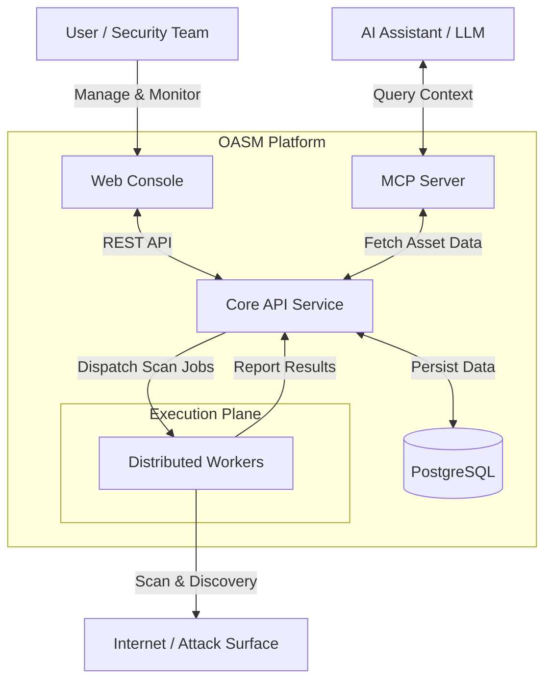
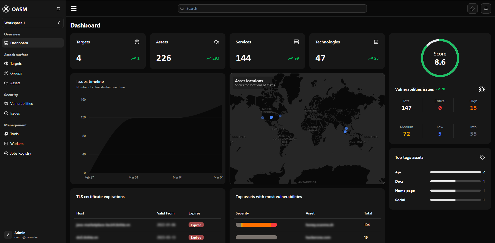
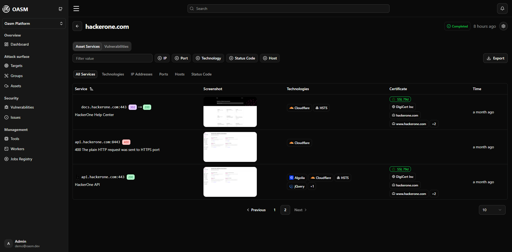
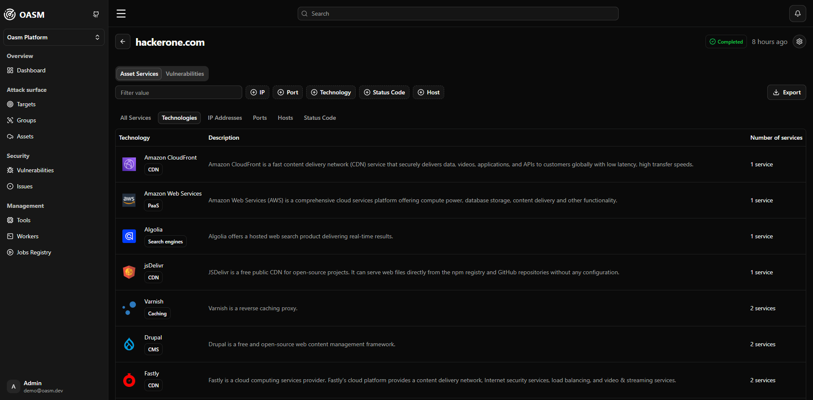
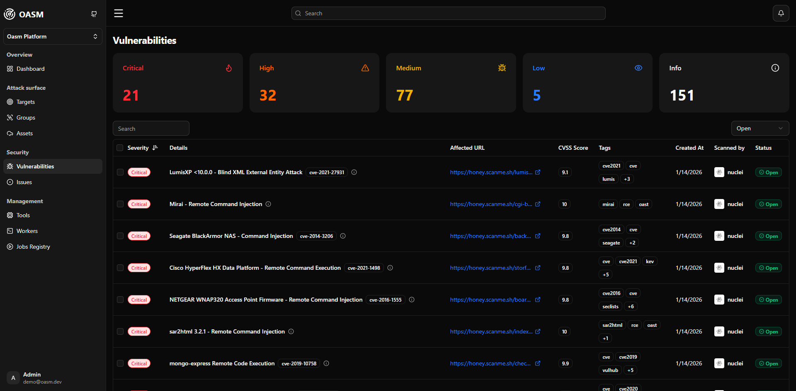
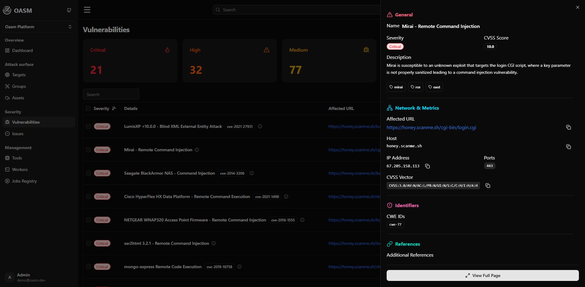
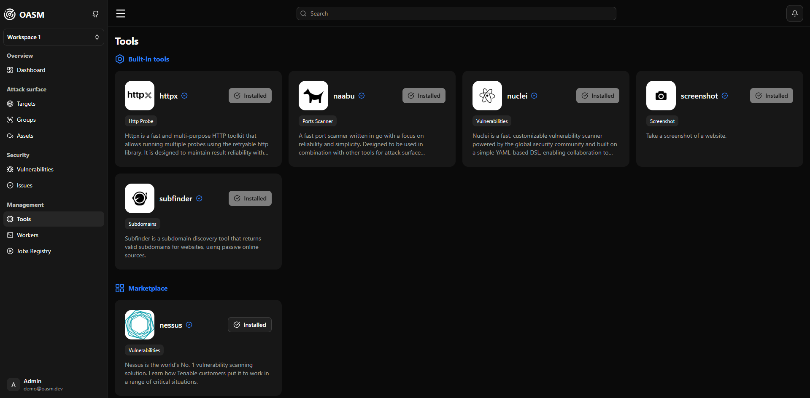
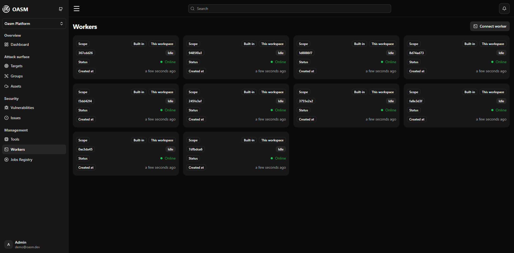
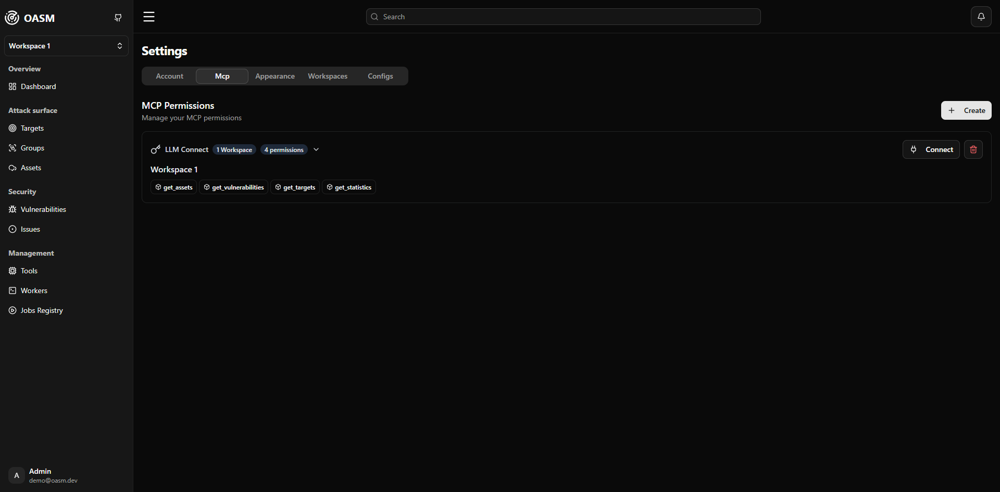
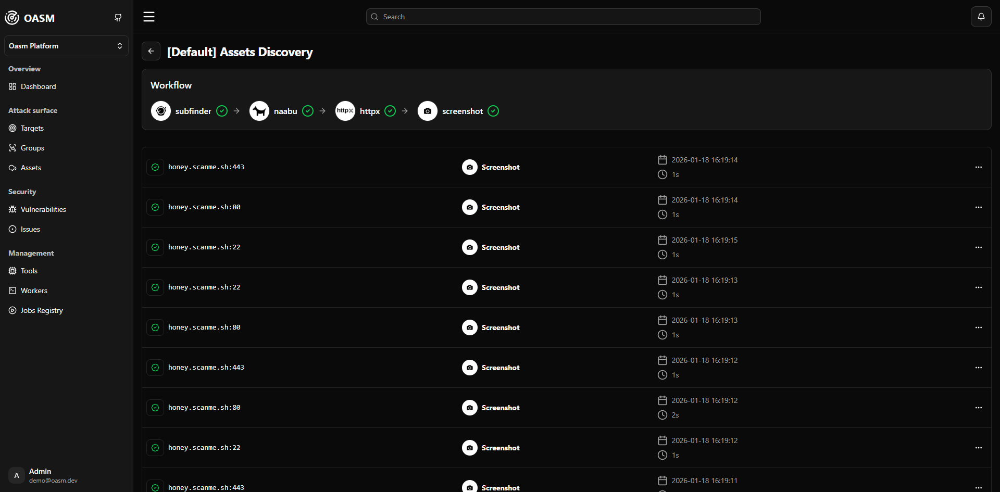

# Open Attack Surface Management (OASM)

[](https://github.com/oasm-platform/open-asm/releases)
[](https://github.com/oasm-platform/open-asm/actions/workflows/build-nightly.yml)
[](https://github.com/oasm-platform/open-asm/actions/workflows/build-release.yml)
[](https://hub.docker.com/u/oasm)
[](https://github.com/oasm-platform/open-asm/actions/workflows/build-unstable.yml)

Open-source platform for cybersecurity Attack Surface Management. Built to help security teams identify, monitor, and manage external assets and potential security exposures across their digital infrastructure.

<p align="center">
  <a href="#features">Features</a> •
  <a href="#system-architecture">System Architecture</a> •
  <a href="#installation">Installation</a> •
  <a href="#developer-guide">Developer Guide</a> •
  <a href="#screenshots">Screenshots</a>
</p>

## Features

- **Asset Discovery**: As a free and open-source solution, OASM provides comprehensive, continuous discovery of all internet-facing assets, including domains, subdomains, IP addresses, and web services. It automatically catalogs and inventories these assets in real-time, ensuring no hidden or forgotten resources are left unmanaged, helping security teams maintain a complete view of their digital footprint without any cost.
- **Risk Assessment**: OASM offers ongoing, in-depth risk assessment by continuously scanning for vulnerabilities, misconfigurations, and potential security exposures across the entire attack surface. This comprehensive approach ensures that threats are identified early and thoroughly, providing detailed insights into risks without requiring expensive subscriptions or licenses.
- **Monitoring and Alerts**: With real-time monitoring capabilities, OASM tracks changes in assets continuously and sends immediate notifications for new risks or exposures. This free, proactive system allows security teams to respond quickly to emerging threats, maintaining constant vigilance over their infrastructure at no additional cost.

## System Architecture

The system runs on a distributed architecture consisting of:

- A web-based console for user interaction and monitoring.
- A core API service handling business logic, data persistence, and job orchestration.
- Distributed workers for high-performance scanning tasks with auto-scaling capabilities.
- PostgreSQL database for data storage and Better Auth for authentication.



## Screenshots



















## Installation

To quickly get started with OASM using Docker:

1. Clone the repository:

   ```bash
   git clone https://github.com/oasm-platform/oasm-docker.git
   cd oasm-docker
   ```

2. Rename the example environment file:

   ```bash
   cp example.env .env
   ```

3. Start the services:
   ```bash
   docker compose up -d
   ```

This will launch the entire system, including the console, core API, workers, and database. Access the application at the configured URL (http://localhost:6276).

[Docker Repository](https://github.com/oasm-platform/oasm-docker)

## Developer Guide

For detailed instructions on setting up your development environment, running services, and contributing, please refer to our dedicated [Developer Guide](DEVELOPER_GUIDE.md).
