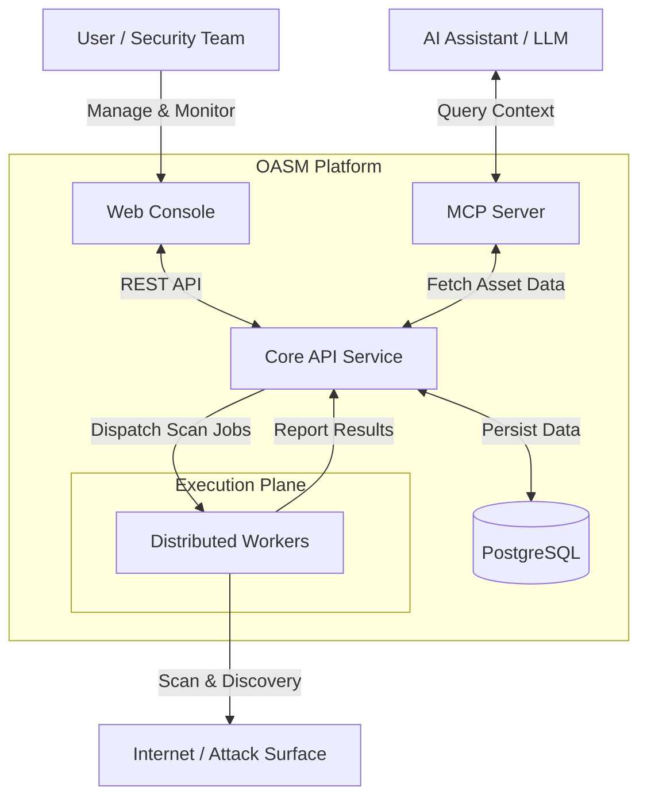

# Open Attack Surface Management (OASM)

[](https://github.com/oasm-platform/open-asm/releases)
[](https://github.com/oasm-platform/open-asm/actions/workflows/build-nightly.yml)
[](https://github.com/oasm-platform/open-asm/actions/workflows/build-release.yml)
[](https://hub.docker.com/u/oasm)
[](https://hub.docker.com/r/oasm/oasm-api)
[](https://github.com/oasm-platform/open-asm/actions/workflows/build-unstable.yml)

Open-source platform for cybersecurity Attack Surface Management. Built to help security teams identify, monitor, and manage external assets and potential security exposures across their digital infrastructure.

<p align="center">
  <a href="#features">Features</a> •
  <a href="#system-architecture">System Architecture</a> •
  <a href="#installation">Installation</a> •
  <a href="#developer-guide">Developer Guide</a> •
  <a href="#screenshots">Screenshots</a>
</p>

## Features

- **Asset Discovery & Management**: Comprehensive discovery and cataloging of internet-facing assets including domains, subdomains, IP addresses, and web services. Supports asset grouping, real-time inventory updates, and multi-workspace organization for efficient asset lifecycle management.
- **Vulnerability Assessment**: Continuous scanning for vulnerabilities, misconfigurations, and security exposures across the entire attack surface. Advanced issue tracking with detailed risk analysis, prioritization, and remediation guidance.
- **Technology Detection**: Automated identification and cataloging of technologies, frameworks, and services running on discovered assets. Provides insights into technology stacks and potential security implications.
- **Distributed Scanning Engine**: High-performance distributed workers with auto-scaling capabilities for parallel processing of scanning tasks. Job orchestration and registry system for managing complex scanning workflows.
- **Tool Integration**: Extensible framework for integrating various security scanning tools and services. Supports custom tool configurations and automated execution pipelines.
- **AI Assistant Integration**: Model Context Protocol (MCP) server integration enabling AI assistants to query asset data, generate insights, and assist with security analysis through natural language interfaces.
- **Workflow Automation**: Configurable workflows for automated scanning schedules, alert responses, and remediation processes. Template-based approach for standardizing security operations.
- **Real-time Monitoring & Notifications**: Continuous monitoring of asset changes with instant notifications for new discoveries, vulnerabilities, and configuration changes. Statistics dashboard with trend analysis and reporting.
- **Advanced Search & Analytics**: Powerful search capabilities across all asset data with filtering and faceting. Comprehensive analytics for attack surface metrics, risk trends, and compliance reporting.

## System Architecture

The system runs on a distributed architecture consisting of:

- A web-based console for user interaction and monitoring.
- A core API service handling business logic, data persistence, and job orchestration.
- Distributed workers for high-performance scanning tasks with auto-scaling capabilities.
- PostgreSQL database for data storage and Better Auth for authentication.



## Screenshots


## Installation

To quickly get started with OASM using Docker:

1. Clone the repository:

   ```bash
   git clone https://github.com/oasm-platform/oasm-docker.git
   cd oasm-docker
   ```

2. Rename the example environment file:

   ```bash
   cp .env.example .env
   ```

3. Start the services:
   ```bash
   docker compose up -d
   ```

This will launch the entire system, including the console, core API, workers, and database. Access the application at the configured URL (http://localhost:6276).

[Docker Repository](https://github.com/oasm-platform/oasm-docker)

## Developer Guide

For detailed instructions on setting up your development environment, running services, and contributing, please refer to our dedicated [Developer Guide](DEVELOPER_GUIDE.md).
