<p align="center">
  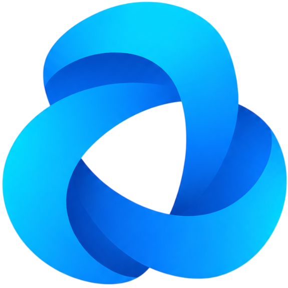
</p>

<h1 align="center">Open Attack Surface Management (OASM)</h1>

<p align="center">
  <a href="https://github.com/oasm-platform/open-asm/releases"></a>
  <a href="https://github.com/oasm-platform/open-asm/actions/workflows/build-nightly.yml"></a>
  <a href="https://hub.docker.com/r/oasm/oasm-api"></a>
  <a href="https://discord.gg/vJYq3QYph"></a>
  <a href="https://www.linkedin.com/company/oasm-platform"></a>
  <a href="https://x.com/OasmPlatform"></a>
  <a href="https://docs.oasm.dev"></a>
</p>

AI-powered, open-source Attack Surface Management platform. Discover, monitor, and secure your digital infrastructure — from assets to exposures — backed by distributed scanning, real-time monitoring, and AI-driven analytics.

<p align="center">
  <a href="#features">Features</a> •
  <a href="#system-architecture">System Architecture</a> •
  <a href="#installation">Installation</a> •
  <a href="#developer-guide">Developer Guide</a> •
  <a href="#screenshots">Screenshots</a>
</p>

## Features

- **Asset Discovery & Management** — Automatically discover and manage internet-facing assets (IPs, ports, services, technologies) as a continuously updated inventory.
- **Vulnerability Assessment** — Detect vulnerabilities and misconfigurations with issue tracking, risk analysis, and remediation guidance.
- **Technology Detection** — Identify frameworks, platforms, and services running on discovered assets.
- **Groups & Targeted Scanning** — Organize assets into groups with custom tool configurations and execution schedules for focused scans.
- **Distributed Scanning Engine** — High-performance Go workers with gRPC communication, designed for horizontal scaling.
- **Tool Integration** — Built-in integration with nuclei, subfinder, httpx, naabu, dnsx and an extensible framework for custom tools.
- **Workflow Automation** — Automated scan scheduling, alerts, and remediation workflows.
- **Real-time Monitoring** — SSE-based real-time notifications and a live statistics dashboard.
- **Search & Analytics** — Full-text search, asset filtering, risk trend analysis, and reporting.
- **Integrations** — Connect Slack, Telegram, and Webhooks for event-driven security alerts.
- **AI Assistant Integration** — MCP server enabling AI assistants (OpenAI, Anthropic, Google) to query and analyze asset data via natural language.
- **Geo-IP Enrichment** — Automatic IP geolocation enrichment for discovered assets.
- **File Storage** — S3-compatible object storage (Rustfs) for scan artifacts and reports.
- **Multi-workspace** — Isolated environments for different organizations, projects, or environments.

## System Architecture

The system runs on a distributed architecture consisting of:

* A React-based web console (Vite + TanStack Query/Router) for user interaction, asset management, and real-time monitoring.
* A NestJS core API service responsible for business logic, data persistence, and job orchestration.
* A Redis-based queue and caching layer (BullMQ) enabling asynchronous job distribution, rate limiting, and system decoupling.
* Distributed Go workers that execute high-performance scanning tasks via gRPC, designed for horizontal auto-scaling and fault tolerance.
* A PostgreSQL database (with pgvector) for persistent storage of assets, scan results, and system state.
* A Rustfs (S3-compatible) object storage for scan artifacts and reports.
* A Geo-IP proxy service for automatic IP geolocation enrichment.
* An MCP (Model Context Protocol) server that provides structured context to AI systems.
* Integration with AI/LLM components (AI SDK, LangGraph) for intelligent querying, analysis, and automation over collected asset data.

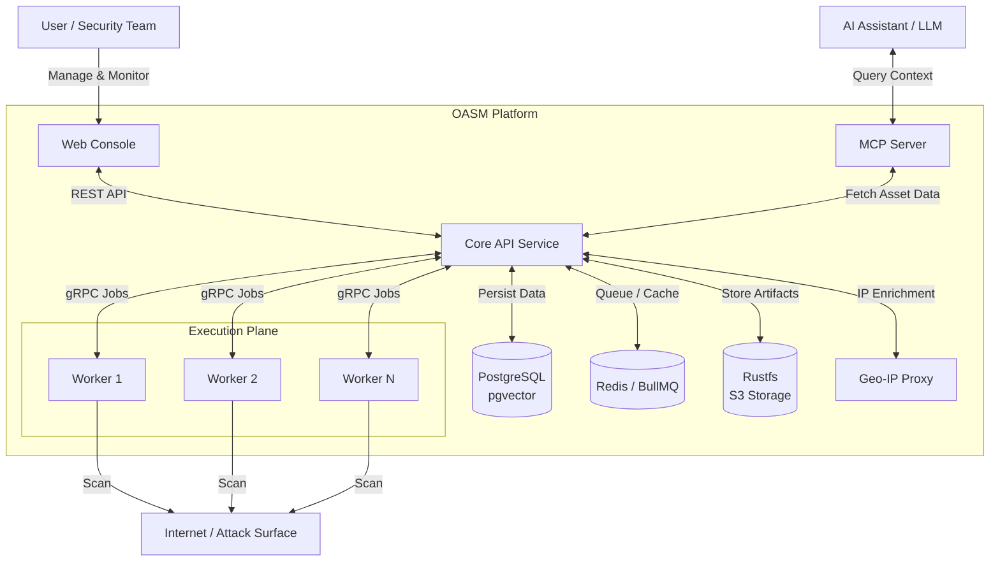
```mermaid
graph TD
    %% Actors & External
    User[User / Security Team]
    AI[AI Assistant / LLM]
    Internet[Internet / Attack Surface]

    %% Core Components
    subgraph "OASM Platform"
        Console[Web Console<br/>]
        API[Core API Service<br/>]
        DB[(PostgreSQL<br/>pgvector)]
        Redis[(Redis / BullMQ)]
        MCP[MCP Server]
        Rustfs[(Rustfs<br/>S3 Storage)]
        GeoIP[Geo-IP Proxy]

        subgraph "Execution Plane"
            W1[Worker 1]
            W2[Worker 2]
            WN[Worker N]
        end
    end

    %% Relationships
    User -->|Manage & Monitor| Console
    Console <-->|REST API| API

    API <-->|Persist Data| DB
    API <-->|Queue / Cache| Redis
    API <-->|Store Artifacts| Rustfs
    API <-->|IP Enrichment| GeoIP

    %% Job Flow (gRPC)
    API <-->|gRPC Jobs| W1
    API <-->|gRPC Jobs| W2
    API <-->|gRPC Jobs| WN

    %% Scan
    W1 -->|Scan| Internet
    W2 -->|Scan| Internet
    WN -->|Scan| Internet

    %% AI Flow
    AI <-->|Query Context| MCP
    MCP <-->|Fetch Asset Data| API
```

## Screenshots

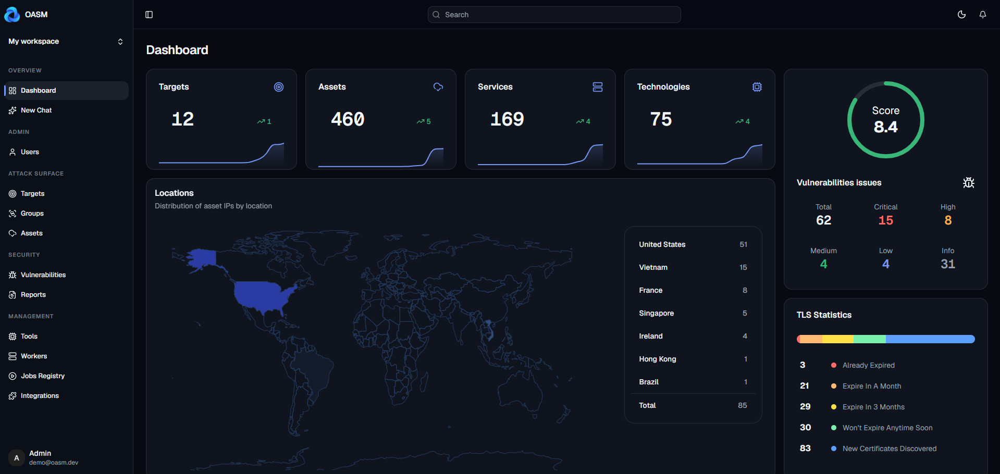

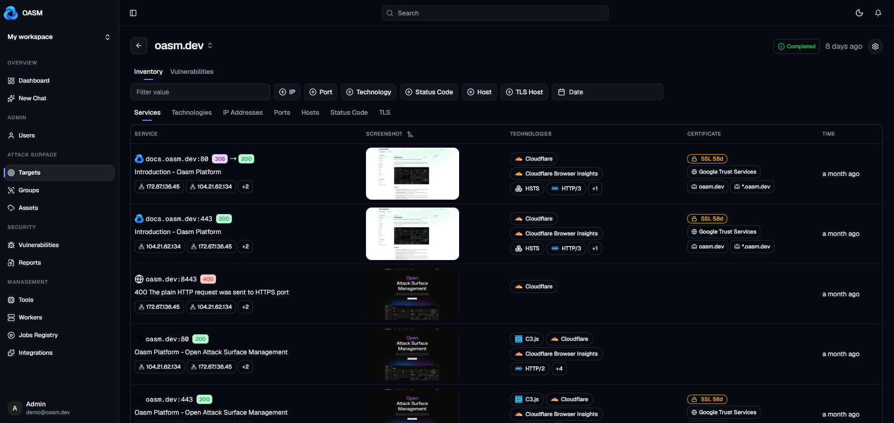

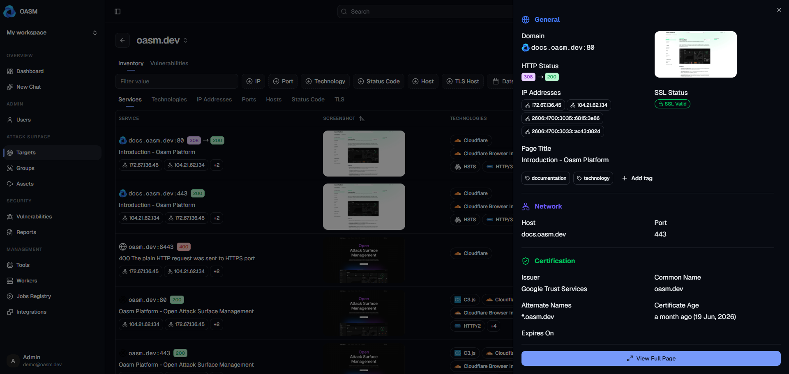

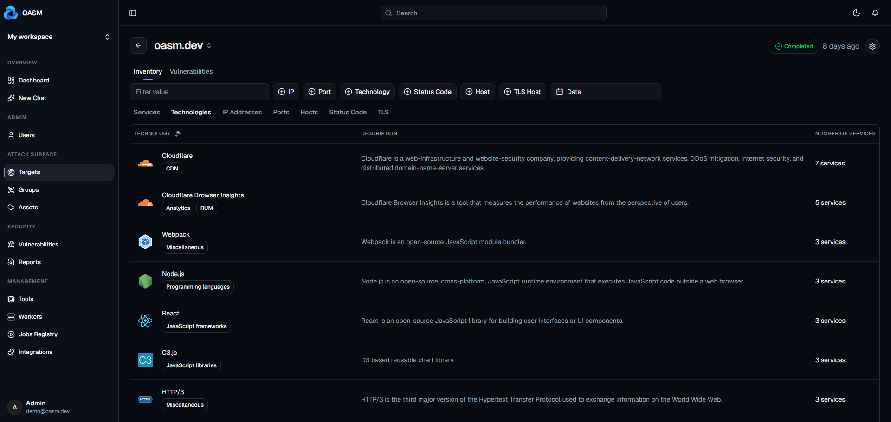

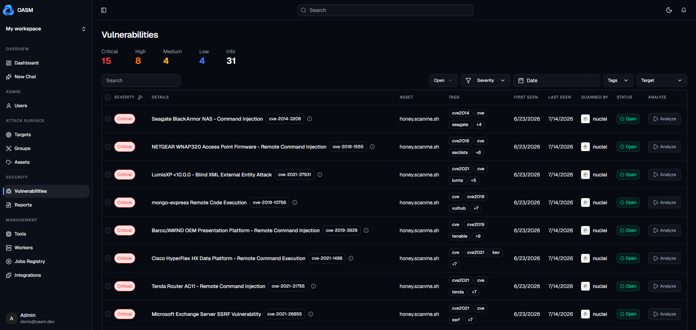

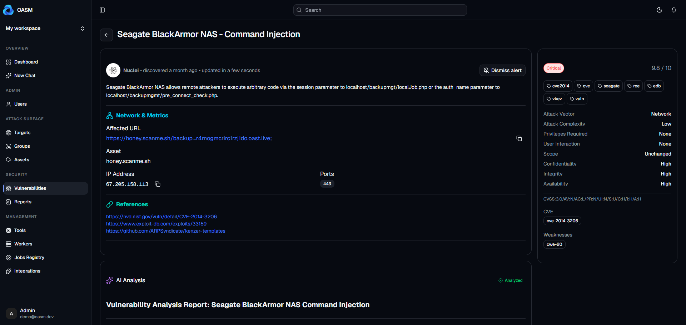

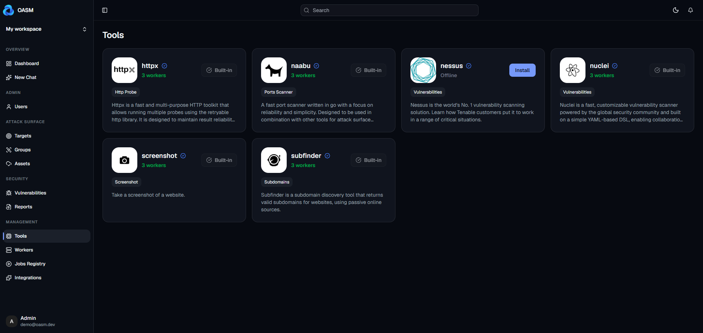

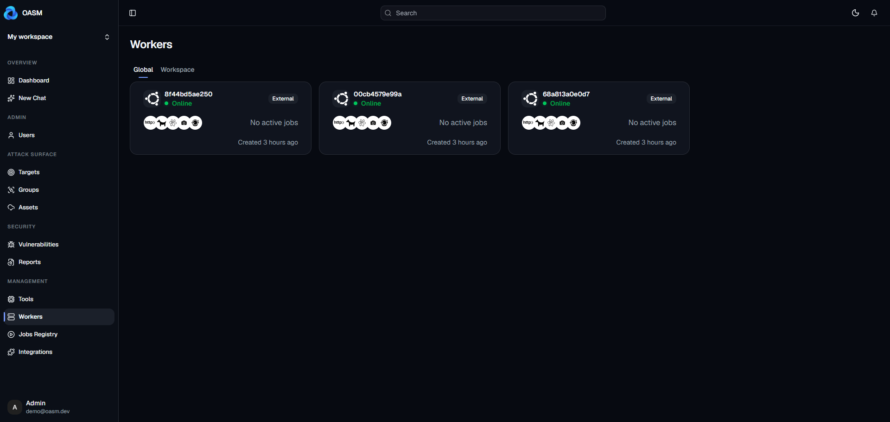

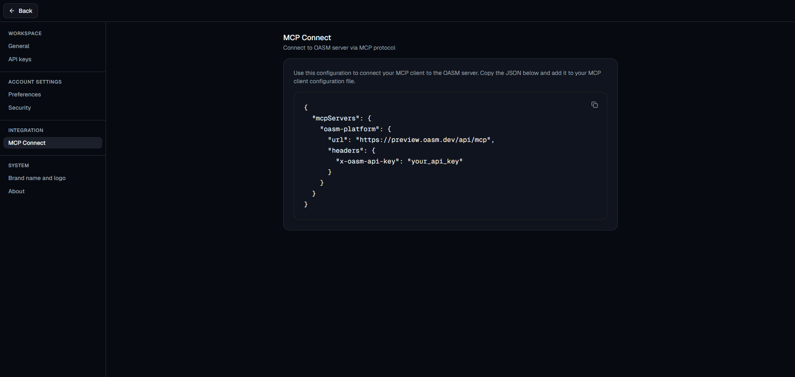

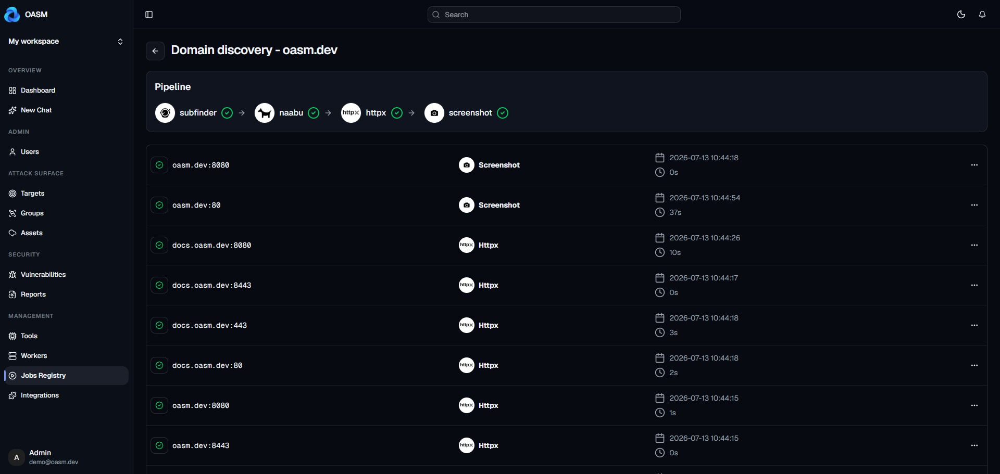

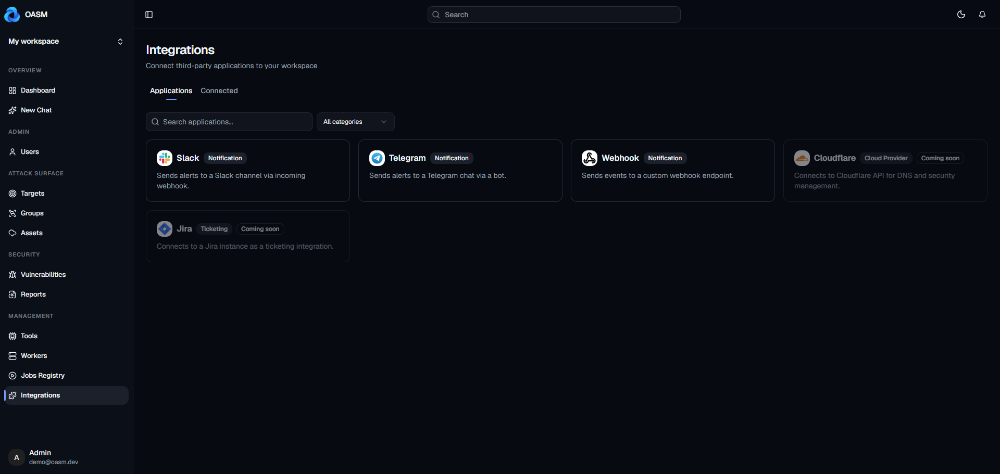

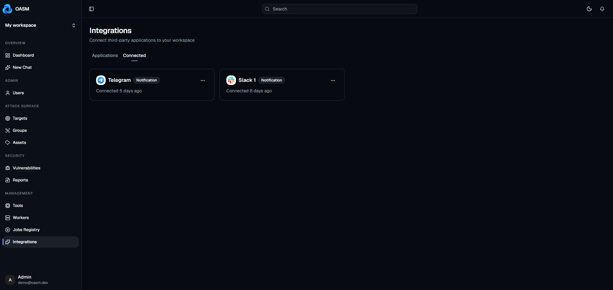

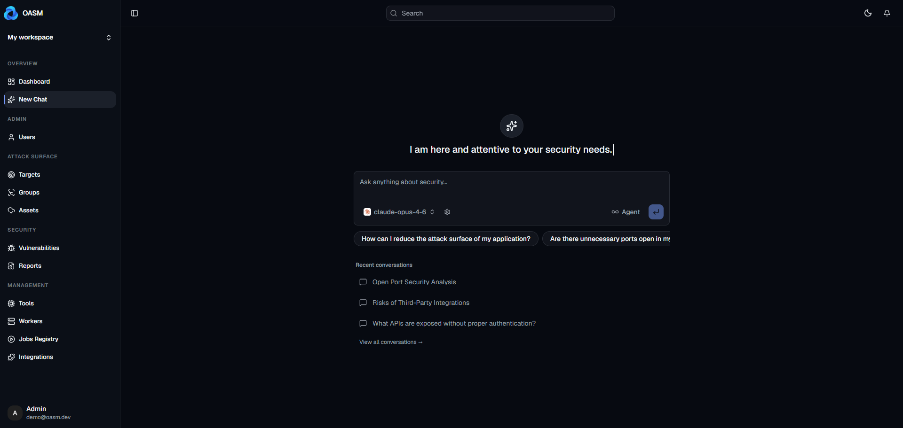

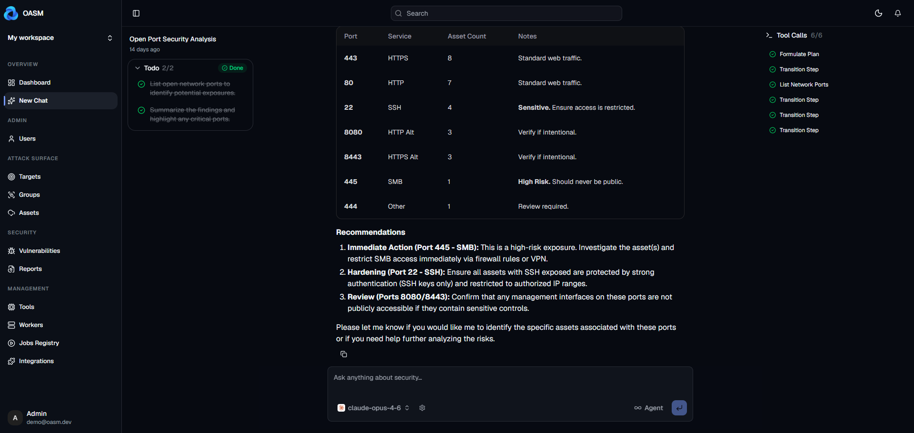

## Installation

### Docker (Recommended)

To quickly get started with OASM using Docker:

1. Clone the repository:

   ```bash
   git clone https://github.com/oasm-platform/open-asm.git
   cd open-asm
   ```

2. Copy the example environment files:

   ```bash
   cp core-api/example.env core-api/.env
   cp console/example.env console/.env
   cp worker/example.env worker/.env
   ```

3. Start the services:

   ```bash
   docker compose up -d --build
   ```

This will launch the entire system, including the console, core API, workers, PostgreSQL, Redis, Geo-IP proxy, and Rustfs storage. Access the console at `http://localhost:3000`.

### Pre-built Images

You can also use pre-built images from Docker Hub:

```bash
docker compose -f docker-compose.yml up -d
```

Images: `oasm/oasm-console`, `oasm/oasm-api`, `oasm/oasm-worker`

## Developer Guide

For detailed instructions on setting up your development environment, running services, and contributing, please refer to our dedicated [Developer Guide](DEVELOPER_GUIDE.md).

### Quick Start

```bash
# Install all dependencies and worker tools
task init

# Start API + Console dev servers
task dev

# Run workers locally
task worker:dev
```

### Key Commands

```bash
task test          # Run API tests
task lint          # Lint API + Console
task build         # Build all services
task docker-compose # Start full stack with Docker
task gen-api       # Regenerate console API client
task proto         # Regenerate gRPC stubs
task migration:run # Run database migrations
```

## Tech Stack

| Service | Technology |
|---------|-----------|
| **Console** | React 19, Vite, Tailwind CSS v4, TanStack Query/Router, shadcn/ui |
| **Core API** | NestJS 11, TypeORM, BullMQ, AI SDK, LangGraph |
| **Worker** | Go 1.26, Cobra, Viper, go-rod (browser automation) |
| **Database** | PostgreSQL 17 + pgvector |
| **Queue/Cache** | Redis + BullMQ |
| **Object Storage** | Rustfs (S3-compatible) |
| **Communication** | REST API, gRPC, SSE |