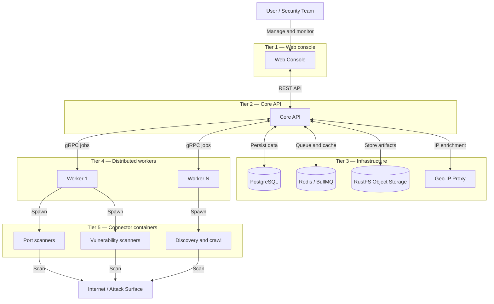
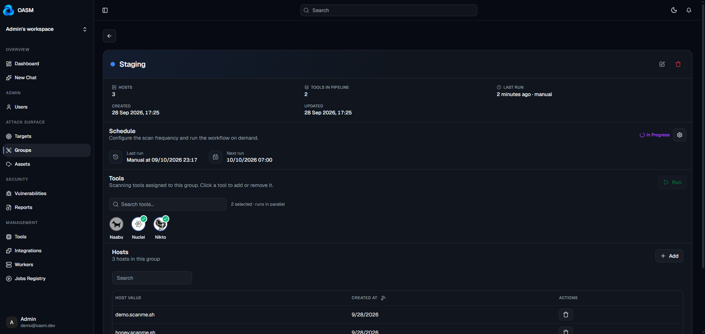

<p align="center">
  
</p>

<h1 align="center">Open Attack Surface Management (OASM)</h1>

<p align="center"><strong>Open-source Attack Surface Management. Discover assets. Identify exposure. Own your security data.</strong></p>

<p align="center">
  <a href="https://github.com/oasm-platform/open-asm/releases"></a>
  <a href="https://github.com/oasm-platform/open-asm/actions/workflows/build-nightly.yml"></a>
  <a href="https://hub.docker.com/r/oasm/oasm-api"></a>
  <a href="https://discord.gg/fWqbNHXR8H"></a>
  <a href="https://www.linkedin.com/company/oasm-platform"></a>
  <a href="https://x.com/OasmPlatform"></a>
  <a href="https://docs.oasm.dev"></a>
</p>

OASM is a self-hostable, open-source Attack Surface Management platform. It inventories internet-facing assets, runs distributed scans through pluggable connectors, and tracks the resulting vulnerabilities in one workspace — so security teams stop stitching together spreadsheets, one-off scanners, and hosted-only tools.

📖 **Documentation → [docs.oasm.dev](https://docs.oasm.dev)**

## Table of Contents

- [Overview](#overview)
- [Key Features](#key-features)
- [Architecture](#architecture)
- [Connectors](#connectors)
- [Integrations](#integrations)
- [Screenshots](#screenshots)
- [Quick Start](#quick-start)
- [Development](#development)
- [Contributing](#contributing)
- [Security](#security)
- [Community and Resources](#community-and-resources)
- [License](#license)

## Overview

External attack surface grows faster than teams can track: forgotten subdomains, exposed ports, outdated frameworks, leaked URLs, misconfigured cloud assets. Point scanners answer one question at a time; hosted ASM tools answer them but keep your asset data on someone else's infrastructure.

Attack Surface Management (ASM) in practice means three loops:

1. **Discover** — enumerate what is exposed (domains, IPs, ports, services, technologies, URLs, TLS certificates).
2. **Assess** — run scanners against those assets and normalize findings into trackable vulnerabilities.
3. **Operate** — group assets, schedule recurring scans, notify the right channel, and audit what changed.

OASM implements these loops as one integrated, self-hosted stack: a web console for daily work, a NestJS core API for business logic and orchestration, and Go workers that execute scans in isolated connector containers. PostgreSQL (pgvector), Redis/BullMQ, S3-compatible storage, and a Geo-IP proxy back the platform. Your data stays in your infrastructure; scanning tools stay decoupled so adding a tool never requires an OASM release.

## Key Features

| Area | What it does |
|------|--------------|
| **Asset inventory** | One searchable inventory of domains, IPs, ports, services, technologies, discovered URLs, and TLS certificates — filter, page through large estates, view the topology graph, export CSV for reporting. |
| **Vulnerability tracking** | Scan findings normalized into trackable vulnerabilities with severity, status, and evidence detail, so teams triage and follow up in one place. |
| **Asset groups + schedules** | Bundle related assets, attach scan workflows with cron schedules (or pause with `disabled`), and trigger on-demand runs per group. |
| **Distributed workers** | Workers join over gRPC, pull queued jobs, run each scan in an isolated container, and stream findings back. One worker per host. |
| **Pluggable connectors** | 10 versioned scanner images maintained in a companion repo and synced locally — adding or upgrading a tool never requires an OASM release. |
| **Workflows** | Cron-scheduled or event-triggered scan workflows with a job graph, so recurring coverage runs without manual kicks. |
| **Notifications** | In-app notifications plus Slack, Telegram (webhook with polling fallback), and generic webhooks for alert delivery. |
| **Cloud asset sync** | Scheduled pull of assets from AWS, Cloudflare, and Vercel, keeping the inventory in sync with cloud estates. |
| **AI access** | An MCP endpoint plus an agents module lets AI assistants query and analyze asset data in natural language. |
| **Enrichment & storage** | Automatic IP geolocation plus S3-compatible storage for scan artifacts and PDF reports. |
| **Multi-workspace & access control** | Isolated workspaces per team or project, with owner/member roles, API keys, and an audit log archived as JSONL. |
| **API & docs** | Versioned REST API with interactive Swagger/Scalar docs, backed by a tracked OpenAPI spec the console client is generated from. |

## Architecture

Four tiers: the **web console** you operate daily, the **core API** holding business logic and orchestration, an **infrastructure tier** storing and enriching data, a **distributed worker tier** executing scans, and **connector containers** running each security tool in isolation. The core API also hosts the **Security Agent** — a chat-driven runtime that plans work and calls tools against workspace data and worker nodes.


```mermaid
graph TD
    User[User / Security Team]
    Internet[Internet / Attack Surface]

    subgraph "Tier 1 — Web console"
        Console[Web Console]
    end

    subgraph "Tier 2 — Core API"
        API[Core API]
    end

    subgraph "Tier 3 — Infrastructure"
        DB[(PostgreSQL)]
        Redis[(Redis / BullMQ)]
        Rustfs[(RustFS Object Storage)]
        GeoIP[Geo-IP Proxy]
    end

    subgraph "Tier 4 — Distributed workers"
        W1[Worker 1]
        W2[Worker N]
    end

    subgraph "Tier 5 — Connector containers"
        C1[Port scanners]
        C2[Vulnerability scanners]
        C3[Discovery and crawl]
    end

    User -->|Manage and monitor| Console
    Console <-->|REST API| API

    API <-->|Persist data| DB
    API <-->|Queue and cache| Redis
    API <-->|Store artifacts| Rustfs
    API <-->|IP enrichment| GeoIP

    API <-->|gRPC jobs| W1
    API <-->|gRPC jobs| W2

    W1 -->|Spawn| C1
    W1 -->|Spawn| C2
    W2 -->|Spawn| C3

    C1 -->|Scan| Internet
    C2 -->|Scan| Internet
    C3 -->|Scan| Internet
```

How the agent works: chat arrives → the agent loads a specialist skill (`vulnerability-analysis`, `command-execution`, `web-research`, or a custom workspace skill) → drafts an execution plan as ordered steps → the user approves it → each step runs as **tool calls** against workspace data tools (assets, vulnerabilities, targets, ports, technologies, TLS, issues, jobs, workers, statistics), web fetch for CVE/advisory enrichment, or connected external tools. Heavy or privileged work is **delegated**: shell commands execute on connected worker nodes, never on the API host — and every side-effecting call must pass the **approvals gate** first. Findings accumulate in memory and the run ends with Summary → Analysis → Recommendations → Next steps. Two modes: **Ask** answers from data, **Agent** also acts.


A scan's journey: **trigger** (manual, workflow, or schedule) → **waiting** in queue → **running** on a worker → **results merged** into inventory (subdomains, services, ports, vulnerabilities, screenshots) → **downstream** (findings, notifications, dashboard stats) → **finished** in the job registry.

→ Full diagram and scan lifecycle: [docs.oasm.dev/architecture](https://docs.oasm.dev/architecture)

## Connectors

Scanning tools live as isolated Docker images in the companion repo [oasm-connectors](https://github.com/oasm-platform/oasm-connectors), each wrapping a tool in a small adapter. OASM reads that catalog as data (`task sync-connectors`), so a worker resolves the right image and runs the tool on demand inside its own container — adding or upgrading a scanner never needs an OASM release.

## Integrations

Built-in integration connectors in `core-api/src/modules/integrations/connectors/`:

- **Alerting:** Slack, Telegram (bot webhook per integration + polling fallback when `BASE_URL` is unset), generic Webhook.
- **Cloud asset pull:** AWS (incl. SSO device flow), Cloudflare, Vercel — each with a `syncSchedule` cron for periodic sync.

Config is stored as JSONB and validated per `appType` + `category` JSON Schema. Each Telegram bot gets a unique webhook URL (`/api/integrations/telegram/webhook/:integrationId`) secured by an HMAC-derived secret header.

Marketplace catalog: [oasm.dev/marketplace](https://oasm.dev/marketplace). Marketplace listings are not all bundled into core — check what is installed via Tools / Integrations in the console.

## Screenshots


*Dashboard — total counts of targets, assets, services, and technologies, plus the security score, vulnerability breakdown by severity, asset locations on a world map, and TLS certificate expiry stats.*


*Target inventory — every discovered service for a target with screenshots, detected technologies, TLS certificate info, and filters by IP, port, technology, status code, host, and date.*


*Asset detail — drill into a single service to see its HTTP status, IP addresses, page title, tags, network info, and full TLS certificate record.*


*Technology inventory — frameworks, platforms, and protocols detected across the estate, with descriptions and the number of services using each.*


*Asset group — bundle hosts, assign scan tools, set the schedule or run on demand, and track last/next run per group.*


*Vulnerability list — findings grouped by severity with CVE tags, affected asset, first/last seen dates, the scanner that found each one, and status.*


*Vulnerability detail — full write-up of a finding with affected URL, asset, CVSS metrics, CVE/CWE references, and an AI-generated analysis report.*


*Tool catalog — install and manage scanners (HTTP probing, port scanning, subdomain discovery, vulnerability scanning) and see which workers carry each tool.*


*Worker fleet — online status, installed toolset, and active jobs for every scanning worker across global and workspace scopes.*


*MCP connect — copy-paste JSON config that plugs any MCP-compatible AI client into your OASM instance via API key.*


*Job registry — the scan pipeline per target (subdomain discovery → port scan → HTTP probe → screenshot) with per-job status, timing, and history.*


*Integration marketplace — connect alerting (Slack, Telegram, webhook) and cloud providers, with upcoming ticketing and cloud integrations marked.*


*Connected integrations — manage active third-party connections per workspace and their connection history.*


*AI chat — ask security questions in natural language, pick a model, and revisit recent analysis conversations.*


*AI analysis result — the agent plans, queries live asset data, and returns a structured report, e.g. open-port exposure with per-port notes and remediation steps.*

## Quick Start

Prerequisites: Docker + Docker Compose, [Task](https://taskfile.dev/#/installation), Node.js 22, pnpm 10.33.2, Go 1.26 (for local dev).

```bash
git clone https://github.com/oasm-platform/open-asm.git
cd open-asm

cp core-api/example.env core-api/.env
cp console/example.env console/.env
cp worker/.example.env worker/.env   # note the leading dot

task sync-connectors
task docker-compose
```

This builds and starts console, core API, worker, Postgres, Redis, Geo-IP proxy, and RustFS, running pending migrations first via the one-shot `migration` service. Console: `http://localhost:3000`.

| Service | Address |
|---------|---------|
| Console | `http://localhost:3000` |
| Core API | `http://localhost:6276` (gRPC `:16276`, docs `/api/docs`, health `/api/health`) |
| Postgres | `localhost:5432` |
| Redis | `localhost:6379` |
| Geo-IP | `localhost:4360` |
| RustFS | `localhost:9000` (admin UI `:9001`) |
| Worker callback | `:26276` (one worker per host — do not `--scale oasm-worker`) |

Notes:

- Set `WORKER_API_KEY` in `worker/.env` to the key the API expects.
- On native Linux the worker needs the Docker socket group: `task docker-compose` detects `WORKER_DOCKER_GID` automatically. Raw `docker compose up` needs `WORKER_DOCKER_GID=$(stat -c '%g' /var/run/docker.sock) docker compose up -d --build`.
- The socket mount is root-equivalent — only run trusted connector images.
- Pre-built images: `oasm/oasm-console`, `oasm/oasm-api`, `oasm/oasm-worker` on Docker Hub.
- Production deploy: [oasm-docker](https://github.com/oasm-platform/oasm-docker) — see [docs.oasm.dev/deployment](https://docs.oasm.dev/deployment).

## Development

All commands run from the repo root through `task` (raw `npm run` / `go test` bypass RAM limits and transforms).

```bash
task init       # install deps, copy .env templates, start postgres + redis + geo-ip + rustfs
task dev        # API :6276 + Console :5173 with hot-reload
task worker:dev # local Go worker (needs Docker daemon + reachable API/storage)
```

Key commands: `task build`, `task lint` (API then console, sequential — never parallelize), `task test` (API Jest only), `task console:test:run` (Vitest single pass, what CI runs), `task worker:test` / `task worker:test-race`, `task gen-api` (needs booted API; commit `.open-api/*.json` + regenerated client), `task proto` (regenerate Go gRPC stubs), `task migration:generate name=<Name>` + `task migration:run` (never hand-write migrations).

Layout: `core-api/` (NestJS, `src/modules/*`, `src/mcp/`, `src/proto/`), `console/` (React 19 + Vite + TanStack Router/Query, `src/routes/`, orval client in `src/services/apis/gen/`), `worker/` (Go, `internal/*`, entries `cmd/cli` + `cmd/app`).

→ Full setup, conventions, and CI: [DEVELOPER_GUIDE.md](DEVELOPER_GUIDE.md) · [docs.oasm.dev/developer-guide](https://docs.oasm.dev/developer-guide)

## Contributing

See [`CONTRIBUTING.md`](CONTRIBUTING.md) for the full process. Short version:

1. Fork, branch (`git checkout -b feat/scope-name`), follow [Conventional Commits](https://www.conventionalcommits.org/) (`feat|fix|hot-fix|perf|chore|docs|style|refactor|test|ci(scope):`) — enforced by `commit-msg`.
2. Run `task lint` and relevant tests before pushing (`task api:test`, `task console:test:run`, `task worker:test`). Pre-commit hook is inert — verification is on you. Never hand-write migrations; never hand-edit generated code.
3. Contract changes: run `task gen-api` (commit spec + client); proto changes: `task proto`; schema changes: only via `task migration:generate name=<Name>` after maintainer approval.
4. Open a PR with issue templates (`.github/ISSUE_TEMPLATE/`): bug reports and feature requests welcome — especially new connectors, docs, tests, and supported security workflows.

## Security

See [`SECURITY.md`](SECURITY.md). Short version: report sensitive vulnerabilities via [private Security Advisories](https://github.com/oasm-platform/open-asm/security/advisories/new) — no dedicated email, no formal SLA. Non-sensitive hardening ideas can go in a public [bug report](https://github.com/oasm-platform/open-asm/issues/new?template=bug-report.yml).

## Community and Resources

- Repository: [github.com/oasm-platform/open-asm](https://github.com/oasm-platform/open-asm)
- Issues: [open-asm/issues](https://github.com/oasm-platform/open-asm/issues) (bug-report + feature-request templates)
- Releases: [open-asm/releases](https://github.com/oasm-platform/open-asm/releases)
- Docs: [docs.oasm.dev](https://docs.oasm.dev)
- Connectors repo: [oasm-platform/oasm-connectors](https://github.com/oasm-platform/oasm-connectors)
- Marketplace: [oasm.dev/marketplace](https://oasm.dev/marketplace)
- Discord / LinkedIn / X: see badges at the top.

## License

[GNU General Public License v3.0](LICENSE) — see `LICENSE` in the repo root.

## Star History

If OASM is useful to you, please star the repo — it helps others discover the project.

[](https://www.star-history.com/?repos=oasm-platform%2Fopen-asm&type=date&legend=top-left)
