<p align="center">
  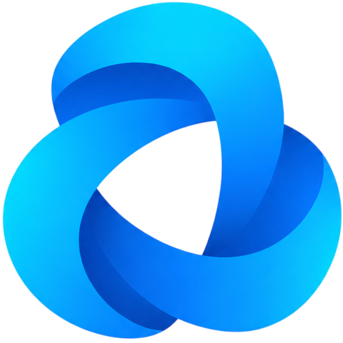
</p>

<h1 align="center">Open Attack Surface Management (OASM)</h1>

<p>
  <a href="https://github.com/oasm-platform/open-asm/releases"></a>
  <a href="https://github.com/oasm-platform/open-asm/actions/workflows/build-nightly.yml"></a>
  <a href="https://hub.docker.com/r/oasm/oasm-api"></a>
  <a href="https://discord.gg/fWqbNHXR8H"></a>
  <a href="https://www.linkedin.com/company/oasm-platform"></a>
  <a href="https://x.com/OasmPlatform"></a>
  <a href="https://docs.oasm.dev"></a>
</p>

AI-powered, open-source Attack Surface Management platform. Discover, monitor, and secure your digital infrastructure — from assets to exposures — backed by distributed scanning, real-time monitoring, and AI-driven analytics.

📖 **Documentation → [docs.oasm.dev](https://docs.oasm.dev)**

## Features

- **Asset Discovery & Management** — Continuously updated inventory of internet-facing assets: domains, IPs, ports, services, and technologies.
- **Vulnerability Assessment** — Detect vulnerabilities and misconfigurations with issue tracking, risk analysis, and remediation guidance.
- **Technology Detection** — Identify frameworks, platforms, and services running on discovered assets.
- **Groups & Targeted Scanning** — Organize assets into groups with custom tool configurations and schedules.
- **Distributed Scanning Engine** — Horizontally scalable workers with fault-tolerant job distribution.
- **Tool Integration** — Pluggable security-tool connectors (nuclei, subfinder, httpx, naabu, dnsx, and more) from [oasm-connectors](https://github.com/oasm-platform/oasm-connectors), plus an SDK for custom tools.
- **Workflow Automation** — Automated scan scheduling, alerts, and remediation workflows.
- **Real-time Monitoring** — Live notifications and a statistics dashboard fed by a streaming event channel.
- **Search & Analytics** — Full-text search, asset filtering, risk trend analysis, and reporting.
- **Integrations** — Alert to Slack, Telegram, or any webhook; pull assets from AWS, Cloudflare, and Vercel on a schedule.
- **AI Assistant Integration** — MCP endpoint letting AI assistants (OpenAI, Anthropic, Google) query and analyze asset data in natural language.
- **Geo-IP Enrichment & File Storage** — Automatic IP geolocation plus S3-compatible storage for scan artifacts and reports.
- **Multi-workspace & RBAC** — Isolated environments per organization or project, with roles, audit log, and API keys.

## Architecture

Three tiers: a **web console** for day-to-day operations, a **core API** holding business logic and job orchestration, and **workers** that pull connector images and run scans in isolated containers. PostgreSQL, Redis, S3-compatible storage, and a Geo-IP proxy sit alongside; an MCP endpoint exposes asset data to AI assistants.

→ Full diagram and scan lifecycle: [docs.oasm.dev/architecture](https://docs.oasm.dev/architecture)

## Connectors

Scanning tools live in a companion repo, [oasm-connectors](https://github.com/oasm-platform/oasm-connectors), which ships each tool as an isolated Docker image wrapping a small Go SDK adapter. Open ASM consumes that catalog as data: `task sync-connectors` pulls the manifest into `core-api/resources/connectors/manifest.json`, and the worker resolves the image and runs it on demand.

Adding or upgrading a tool never requires an Open ASM release — publish the connector upstream and re-sync the manifest.

→ Connector contract, SDK adapter, and catalog usage: [oasm-connectors](https://github.com/oasm-platform/oasm-connectors) · [docs.oasm.dev/tools](https://docs.oasm.dev/tools)

## Installation

```bash
git clone https://github.com/oasm-platform/open-asm.git
cd open-asm

cp core-api/example.env core-api/.env
cp console/example.env console/.env
cp worker/.example.env worker/.env   # note the leading dot

task sync-connectors
task docker-compose
```

This starts console, core API, worker, database, queue, Geo-IP proxy, and object storage, with migrations applied first. Console: `http://localhost:3000`.

Pre-built images are also on Docker Hub: `oasm/oasm-console`, `oasm/oasm-api`, `oasm/oasm-worker`.

> **Deploying for production?** Use [oasm-docker](https://github.com/oasm-platform/oasm-docker) instead — see [docs.oasm.dev/deployment](https://docs.oasm.dev/deployment).

## Development

```bash
task init      # Install deps, copy .env templates, start postgres + redis + geo-ip + rustfs
task dev       # Start API + Console dev servers
task worker:dev # Run a worker locally
```

`task init` does not create `worker/.env` — copy `worker/.example.env` and set `WORKER_API_KEY` yourself. All commands run from the repo root through `task`; raw `npm run` / `go test` bypass the limits baked into the taskfiles.

Key commands: `task build`, `task lint`, `task test`, `task gen-api`, `task proto`, `task migration:generate name=<Name>`, `task migration:run`.

→ Full setup, conventions, and CI: [DEVELOPER_GUIDE.md](DEVELOPER_GUIDE.md) · [docs.oasm.dev/developer-guide](https://docs.oasm.dev/developer-guide)

## Screenshots

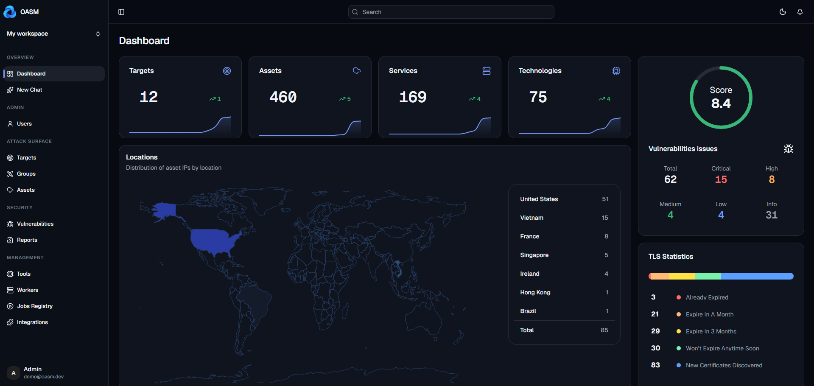

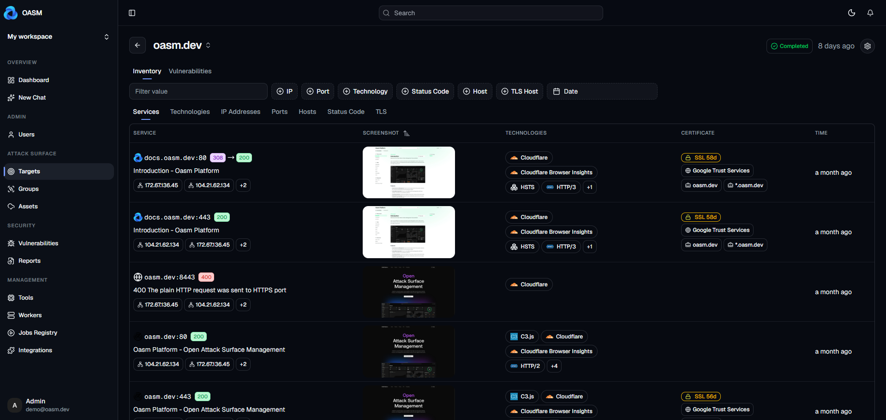

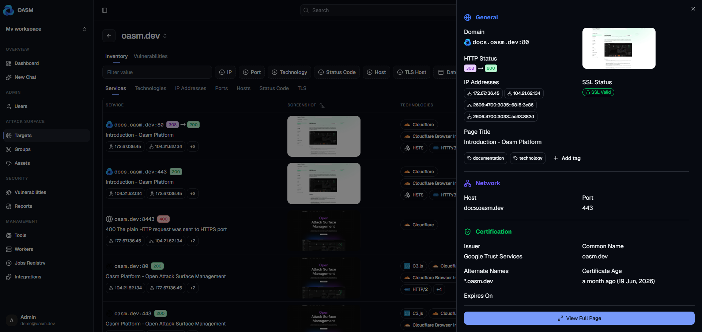

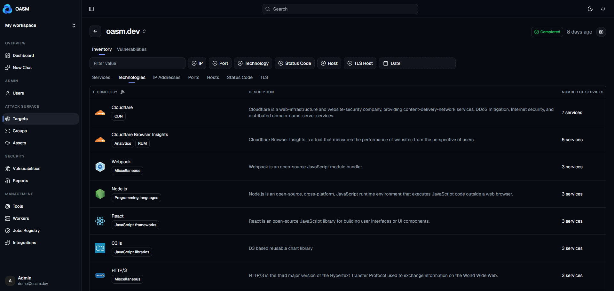

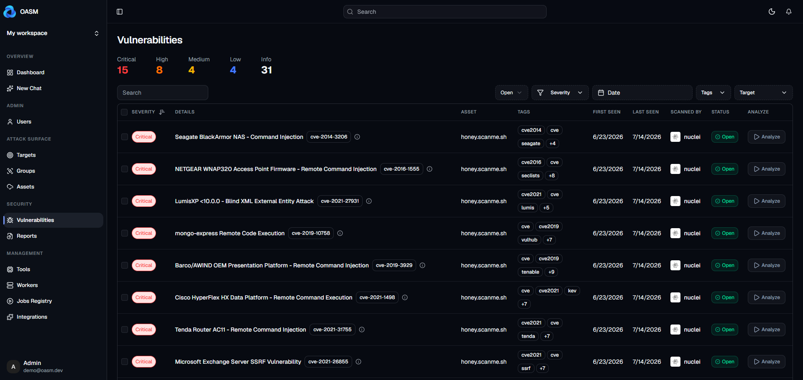

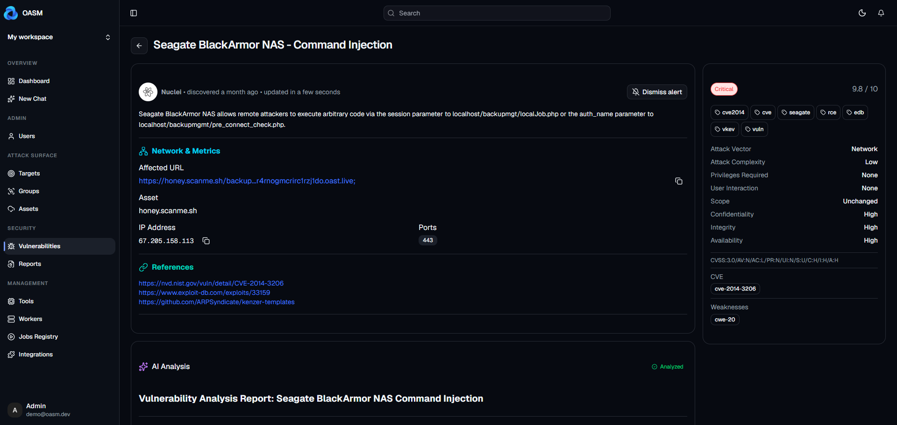

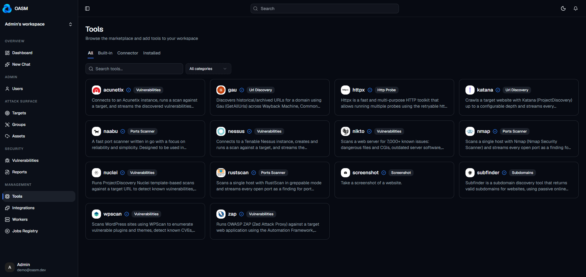

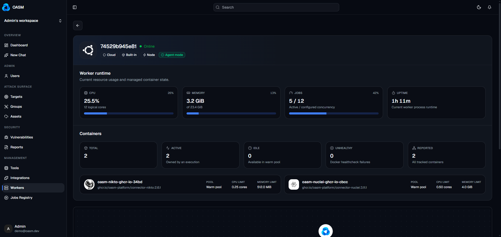

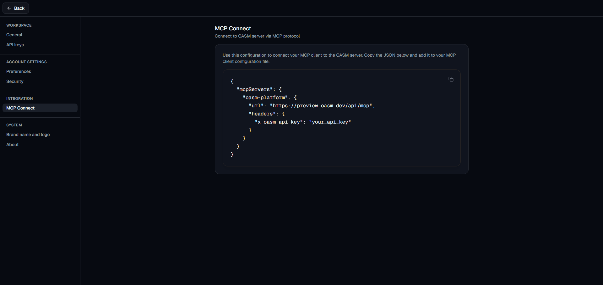

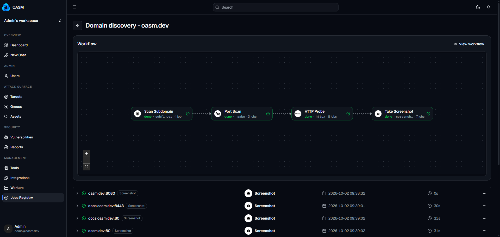

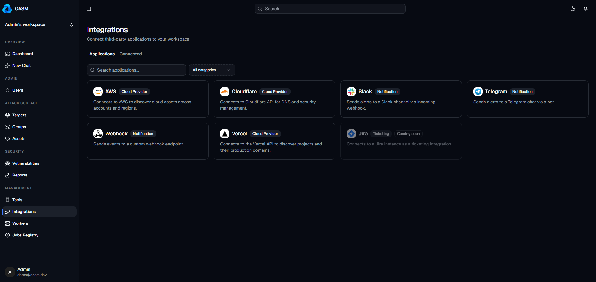

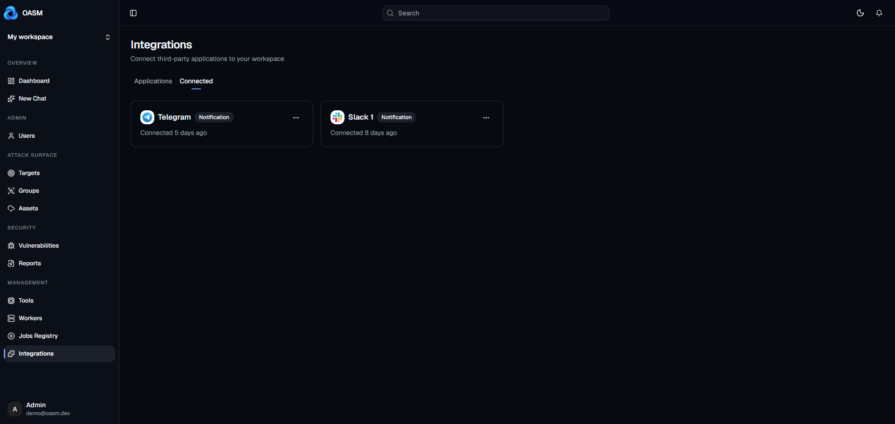

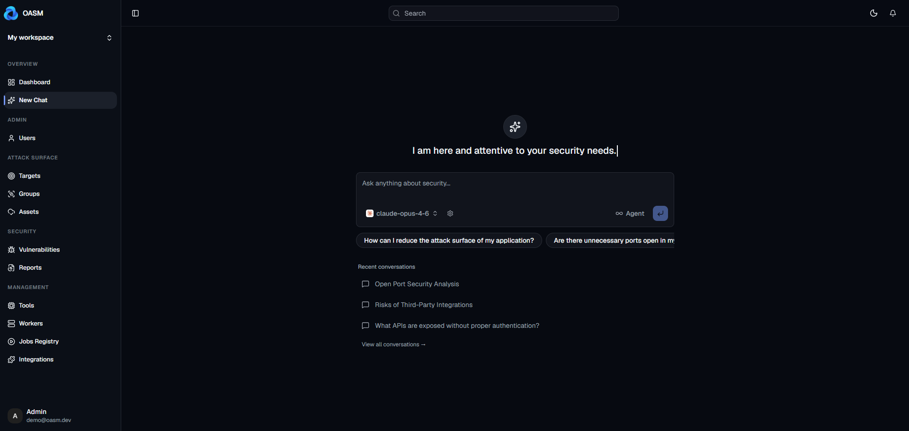

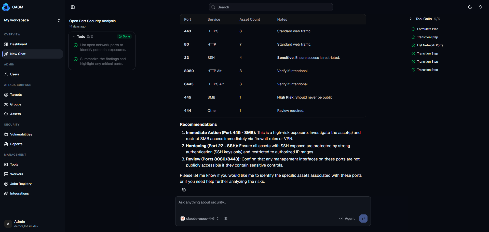
